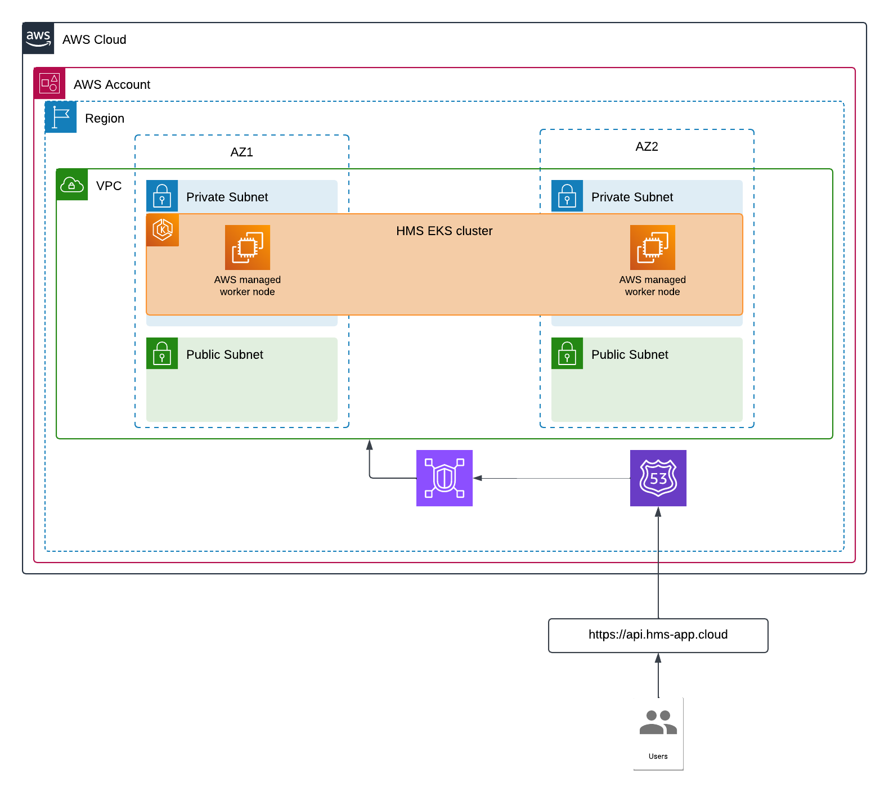
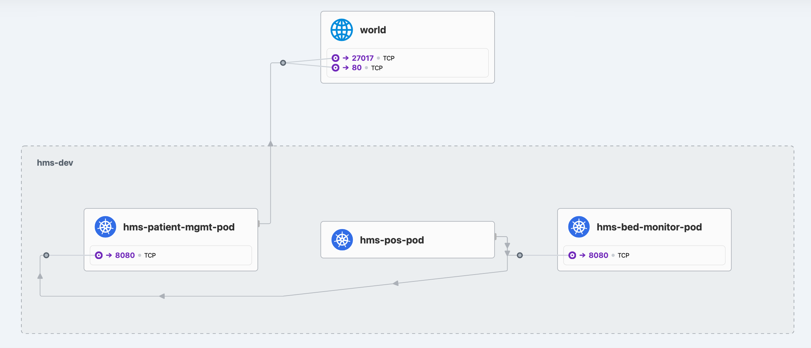
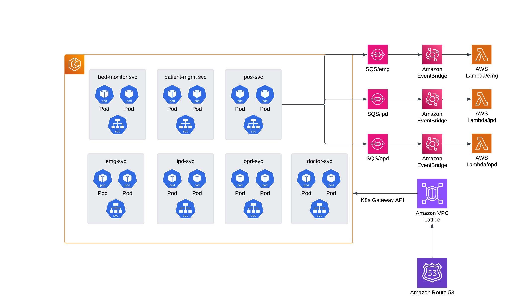

# HMS cluster

a HMS (Hospital Management System) k8s cluster, running on EKS.

## Components
The cluster consists of 7 services:

- patient-mgmt svc
- pos svc (patient onboarding)
- bed monitor svc
- emg svc
- ipd svc
- opd svc
- doctor svc

## Basic service map (on Cilium)
The 3 main services are laid out like this:

## Service diagram on AWS

The services are meshed (for east-west traffic).
North-South traffic is managed by VPC Lattice service network via K8s Gateway API.
And the traffic is routed to the VPC via Route53.

## GitOps

GitOps is managed via Argo Rollouts and ArgoCD with Kargo for easier multi-stage promotion.